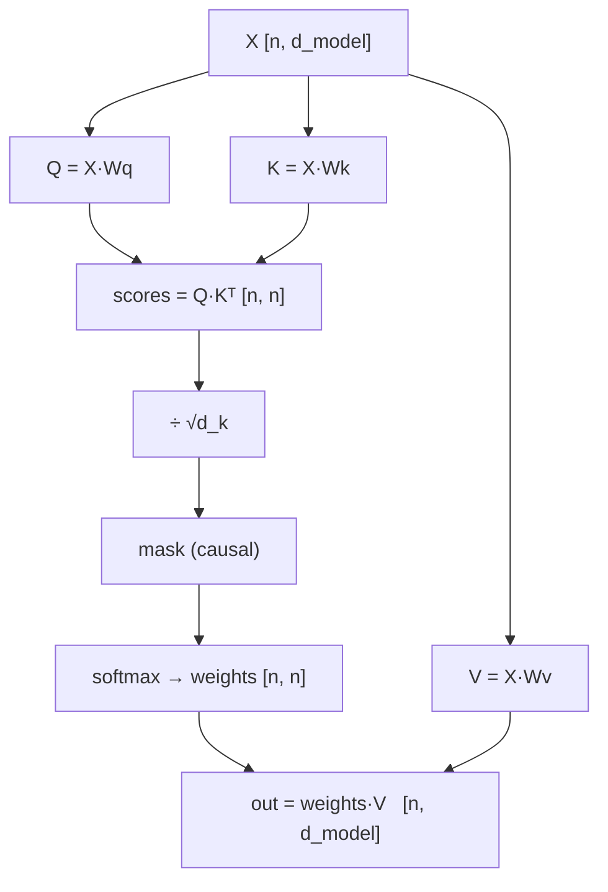

# Scaled Dot-Product Attention

$$\text{Attention}(Q, K, V) = \text{softmax}\!\left(\frac{QK^\top}{\sqrt{d_k}}\right)V$$

One equation, four ideas. Take them in order.

## Q, K, V — three projections of the same input

From input `X` of shape `[n, d_model]`, three learned matrices produce:

| | Name | Read it as |
|---|---|---|
| `Q = X W_q` | Query | "what am I looking for?" |
| `K = X W_k` | Key | "what do I have to offer?" |
| `V = X W_v` | Value | "what I'll actually contribute if picked" |

The split of *addressing* (K) from *content* (V) is the design's real cleverness. A token can be highly findable on one axis while contributing something else entirely.



## Step 1 — score everything against everything

`Q @ K.T` is `[n, n]`: entry `(i, j)` is the dot product of token *i*'s query with token *j*'s key — a raw relevance score, exactly as in [[vectors-and-dot-product]]. This is where the quadratic cost comes from: `n²` scores for `n` tokens. Doubling context quadruples this matrix.

## Step 2 — divide by √d_k, and this is not optional

Take `q` and `k` as independent random vectors with unit-variance components in `d_k` dimensions. Their dot product is a sum of `d_k` such products, so:

$$\text{Var}(q \cdot k) = d_k \quad\Rightarrow\quad \text{std} = \sqrt{d_k}$$

At `d_k = 64`, raw scores swing by ±8 and beyond. Feed those to [[softmax]] and you land in the saturated regime: one weight near 1, the rest near 0, gradient ≈ 0, layer dead. Dividing by `√d_k` renormalizes to unit variance — it is a **temperature correction**, sized to the head dimension.

## Step 3 — softmax to weights

Now each row is a probability distribution over "which tokens should I read from". Row `i` sums to 1. This is the *soft* in soft attention: instead of retrieving one token, you retrieve a weighted blend.

## Step 4 — mix the values

`weights @ V` returns `[n, d_model]`: each token's output is a convex combination of all value vectors. Token *i*'s representation has now been rewritten using context — which is exactly the context-freeness problem from [[embeddings]] being solved.

## Causal masking

For text generation, token *i* must not see token *j > i*, or the model trivially cheats at next-token prediction. Set those scores to `-inf` **before** the softmax, so they exponentiate to 0:

```python
scores = (Q @ K.transpose(-2, -1)) / math.sqrt(d_k)
scores = scores.masked_fill(causal_mask, float('-inf'))   # before softmax, always
weights = scores.softmax(dim=-1)
out = weights @ V
```

Masking after the softmax would leave the row not summing to 1, and the future would still have leaked into the normalizer.

## No notion of order

Notice that nothing in this equation depends on position. Permute the input rows and the output rows permute identically — attention is permutation-equivariant. Order has to arrive from [[positional-encoding]].

:::check
Why is the scaling factor `√d_k` rather than `d_k` or a tuned constant?
:::

:::check
Why must the causal mask be applied before the softmax rather than after?
:::

:::check
What does the separation of keys from values buy you that a single projection would not?
:::
