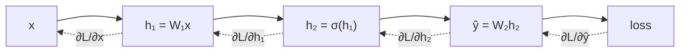

# Backpropagation

Backprop is not a new idea on top of [[chain-rule]] — it's the chain rule with an **ordering** and a **cache**. Both matter enormously.

## Reverse mode, and why it wins

You could differentiate forward: for each parameter, push a perturbation through the network. That's `O(P)` forward passes for `P` parameters. With 7 billion parameters, that is the end of the conversation.

Reverse mode instead computes `∂L/∂(everything)` in **one** backward pass. The asymmetry is: you have *one* scalar output (the loss) and *many* inputs. Reverse mode costs one pass per output; forward mode costs one per input. So for training, reverse mode wins by a factor of `P`.

Each node needs only two things: the local derivative of its own operation, and the gradient flowing in from downstream. Multiply them, pass upstream. Nothing has global knowledge.

## The cache is the memory cost

The backward pass needs activations from the forward pass. `∂(Wx)/∂W = x`, so computing the weight gradient requires the *input* `x` that this layer saw. Which means every intermediate activation must be kept alive from forward until backward.

**This is why training needs so much more memory than inference.** Batch size × sequence length × hidden dim × layers, all resident at once. Two standard escapes:

- **Gradient checkpointing** — store only some activations, recompute the rest during backward. Trades ~30% more compute for a large memory saving.
- **Smaller micro-batches** with gradient accumulation.

At inference time there is no backward pass, so nothing needs retaining — which is exactly what makes the [[kv-cache]] the *only* thing you have to hold onto during generation.

## Where it goes wrong

Gradients are products along paths, so they vanish or explode geometrically. The countermeasures are all structural, and they're covered in [[layer-norm-residuals]]:

- residual connections give a derivative-1 path straight through
- normalization keeps activations in the range where nonlinearities have usable slope
- gradient clipping caps the update norm

:::check
Why does reverse-mode differentiation beat forward-mode for neural network training, and what property of the loss makes that true?
:::

:::check
Why does training use far more memory than inference for the same model and batch size?
:::
