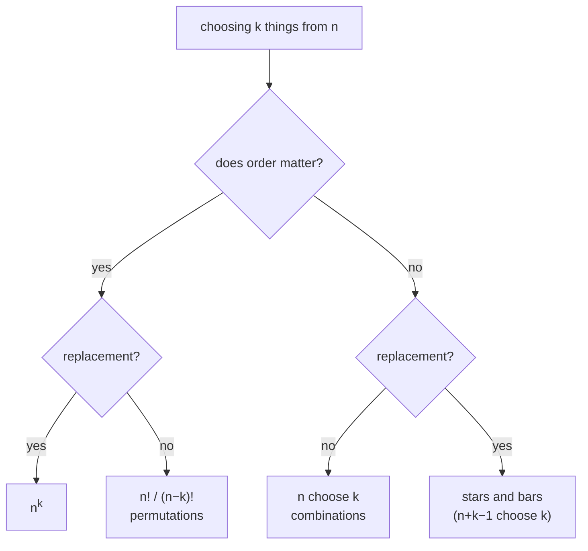

# Counting and Combinatorics

Once the sample space has equally likely outcomes, probability is arithmetic — but the arithmetic is counting, and counting is where the difficulty moves to. Two questions settle almost every case.

## The two questions



Three of those four are worth knowing cold. The fourth, stars and bars, is worth recognising so you know a formula exists.

**Does order matter** is decided by the question, not by the objects. Dealing five cards to one player — order does not matter. Dealing them to five different players — it does.

## Why the binomial coefficient divides

```formula
title: n choose k
tex: '\binom{n}{k} = \frac{n!}{k!\,(n-k)!}'
symbols: [binom-coef, equals, frac-bar, n-trials, factorial, k-count, minus]
reading: The number of ways to choose k things from n, when order does not matter, is n factorial over k factorial times n minus k factorial.
steps:
  - Line the k slots up in order first. There are n choices for the first, n−1 for the second, and so on.
  - That product is n!/(n−k)! — the number of ordered selections.
  - But you did not want them ordered. Each unordered selection got counted once for every way of arranging its k members.
  - There are k! such arrangements, so dividing by k! collapses each group down to the one selection it really was.
notes:
  factorial: Two different jobs here. The numerator counts orderings of everything; the denominators divide out the orderings you did not want to distinguish.
  k-count: How many you are taking. Note the symmetry — choosing k to keep is the same as choosing n−k to discard, which is why the formula is unchanged if you swap them.
  minus: What is left over after choosing. The two factorials on the bottom are the two groups you split n into.
why: >-
  The division is the whole idea, and it is the same move as **overcounting deliberately, then correcting**. That pattern runs through all of combinatorics — count something easy that counts each target several times, then divide by the multiplicity. It is also exactly what makes this a *count* rather than a probability, which is why the binomial distribution needs it as a separate factor.
```

## Worked, with the reasoning visible

**A five-card hand containing exactly two aces.** Choose which 2 of the 4 aces: $\binom{4}{2} = 6$. Choose the other 3 cards from the 48 non-aces: $\binom{48}{3} = 17296$. Multiply, because the choices are independent:

$$
P = \frac{\binom{4}{2}\binom{48}{3}}{\binom{52}{5}} = \frac{6 \cdot 17296}{2598960} \approx 0.0399
$$

The structure — **choose from each group, multiply, divide by the total** — is the template for every hypergeometric problem.

**The birthday problem.** With 23 people, what is the chance two share a birthday? Computing it directly means a union over $\binom{23}{2} = 253$ overlapping pair-events, and inclusion–exclusion on 253 sets is not happening. The complement is one product:

$$
P(\text{all different}) = \frac{365}{365}\cdot\frac{364}{365}\cdots\frac{343}{365} \approx 0.4927
$$

so the answer is about $0.507$. **The complement is the technique, not a trick** — see [[probability-axioms]]. Whenever the event is "at least one", try "none" first.

## The failure modes

**Counting ordered when the problem is unordered, or the reverse.** The symptom is an answer off by exactly $k!$. If your probability comes out above 1, this is almost always why.

**Mixing conventions inside one problem.** If the numerator counts ordered outcomes the denominator must too. Both conventions give the right answer; a mixture never does.

**Assuming equally likely because the objects look alike.** Drawing without replacement changes the probabilities as you go. The counting formula still applies to the *outcomes*, but only if you counted outcomes rather than stages.

**Multiplying counts that are not independent choices.** "Choose a captain, then choose 4 more players from the remaining 10" is fine. "Choose 5 players, then choose a captain" counts the same team five times unless you are careful about what you are enumerating.

## Where it turns up next

The binomial coefficient reappears immediately in [[bernoulli-and-binomial]], where it does exactly the job described above — turning the probability of *one particular* sequence of successes into the probability of *any* sequence with that many. It is the difference between a two-factor formula and a three-factor one.

:::check
What two questions determine which counting formula applies?
:::

:::check
Why does the binomial coefficient divide by $k!$?
:::

:::check
In the birthday problem, why compute the probability that all birthdays differ rather than the probability that some pair matches?
:::
