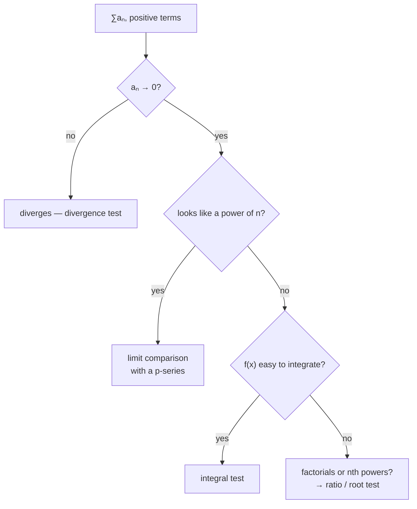

# The Integral and Comparison Tests

Exact sums are hopeless for almost every series, so the question becomes: does it converge? Both tests here answer it the same way — **compare against something already understood.**

These tests all require **positive terms** (or eventually positive). Positive terms make $S_N$ increasing, so by the Monotone Convergence Theorem the only two options are "bounded, hence convergent" and "unbounded, hence divergent". That dichotomy is what makes comparison work at all. Series with mixed signs need [[alternating-series-and-absolute-convergence]].

## The integral test

If $f$ is positive, continuous, and eventually decreasing on $[1,\infty)$, and $a_n = f(n)$:

$$
\sum_{n=1}^{\infty}a_n \ \text{converges} \iff \int_1^{\infty}f(x)\,dx\ \text{converges}
$$

The picture is the proof. Draw rectangles of width 1 and height $a_n$ against the curve $y=f(x)$. Placing them to the right of each sample point puts them under the curve; to the left, above it. So the series is trapped between $\int f$ and $\int f + a_1$ — finite or infinite together.

**All three hypotheses matter.** Decreasing is what makes the rectangles nest against the curve; without it the picture fails.

And note what the test does *not* claim: the series and the integral are **not equal**. $\sum 1/n^2 = \pi^2/6 \approx 1.645$ while $\int_1^\infty x^{-2}dx = 1$. The test transfers convergence, not value.

## p-series — the yardstick

Apply the integral test to $f(x) = x^{-p}$ and read off the p-integral result from [[improper-integrals]]:

$$
\boxed{\sum_{n=1}^{\infty}\frac{1}{n^p}\ \text{converges} \iff p > 1}
$$

$$
\sum\frac{1}{n^2}\ \checkmark \qquad \sum\frac{1}{n^{1.001}}\ \checkmark \qquad \sum\frac{1}{n}\ \times \qquad \sum\frac{1}{\sqrt n}\ \times
$$

$p=1$ diverges. Everything above 1, however slightly, converges. **This is the most useful single fact in the stage** — most series you meet behave like some power of $n$, and comparison turns that resemblance into a verdict.

```viz
type: series
```

Compare **∑1/n** against **∑1/√n** and **∑1/n²** at large N. All three have terms tending to zero; only the last one settles.

## Direct comparison

For $0 \le a_n \le b_n$:

- $\sum b_n$ converges $\Longrightarrow$ $\sum a_n$ converges — *smaller than finite is finite*
- $\sum a_n$ diverges $\Longrightarrow$ $\sum b_n$ diverges — *bigger than infinite is infinite*

**The direction is everything.** Bounding your series *below* by a convergent series tells you nothing; bounding it *above* by a divergent one tells you nothing. Both are common wrong turns, and both feel like progress while you're making them.

$$
\sum\frac{1}{n^2+1}: \quad \frac{1}{n^2+1}<\frac{1}{n^2},\ \text{convergent p-series} \ \Rightarrow\ \text{converges}
$$

## Limit comparison — usually the better tool

If $a_n, b_n > 0$ and

```formula
title: Limit comparison
tex: '\lim_{n\to\infty}\frac{a_n}{b_n} = L, \qquad 0 < L < \infty'
symbols: [limit, n-index, infinity, frac-bar, a-term, b-term, equals, L-limit, less-than]
reading: If the ratio of your terms to a known sequence tends to a finite non-zero number, the two series do the same thing.
steps:
  - Pick a comparison bₙ whose series you already know converges or diverges.
  - Form the ratio of your term to it and take the limit.
  - If that limit is a finite number and not zero, the two sequences shrink at the same rate.
  - Then the two series share a verdict — yours converges exactly when the comparison does.
notes:
  b-term: The yardstick, not the thing being measured. Choose it by keeping only the dominant power top and bottom — that is what makes the ratio settle down.
  less-than: Both strictnesses matter. L = 0 or L = ∞ means the two decay at genuinely different rates and the test says nothing.
  L-limit: Not an answer, only a verdict. Its actual value is irrelevant once you know it is finite and non-zero.
why: >-
  Direct comparison needs a true inequality term by term, which is fiddly to arrange and often just false in the direction you want. Limit comparison only needs the **rates** to match, so it works on the messy algebraic fractions that direct comparison chokes on. The p-series are the yardstick everything gets measured against: **∑1/n^p converges exactly when p > 1**.
```

then both series do the same thing.

This is much easier to use, because you don't have to *prove* an inequality — you only have to notice that two things grow at the same rate.

$$
\sum\frac{2n^2+3n}{n^4 - n + 1}
$$

Keep the dominant powers: $\frac{2n^2}{n^4} = \frac{2}{n^2}$. Compare against $b_n = 1/n^2$; the ratio tends to 2, finite and positive; the $p$-series converges; so does the original. Constructing a direct-comparison inequality here would take real work, and buys nothing.

**How to choose $b_n$:** discard everything but the highest power in the numerator and denominator. That's the rule, and it works because lower-order terms are irrelevant in the limit.

Two edge cases: if $L=0$ then convergence of $\sum b_n$ still gives convergence of $\sum a_n$ (but divergence gives nothing); if $L=\infty$ the implications reverse. Stick to $0<L<\infty$ and you avoid needing them.

## Choosing a test



Run the divergence test first — it's cheap. Then, for anything that looks algebraic in $n$, limit comparison against a p-series is the default. Save the integral test for when the antiderivative is genuinely available, such as terms involving $\ln n$.

:::check
State the integral test with its hypotheses, and say what it does not tell you.
:::

:::check
For which $p$ does $\sum 1/n^p$ converge, and why is that the single most useful fact in this stage?
:::

:::check
Direct comparison requires an inequality in the right direction. What are the two valid conclusions?
:::

:::check
Why is limit comparison usually easier to apply than direct comparison?
:::
