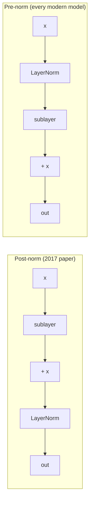

# Layer Norm and Residual Connections

Neither of these is interesting on its own. Together they are the reason you can stack 96 layers instead of 6.

## Residual connections

$$y = x + f(x)$$

The gradient consequence is the entire point. From [[chain-rule]], with multiple paths the derivatives **sum**:

$$\frac{\partial y}{\partial x} = 1 + \frac{\partial f}{\partial x}$$

That `1` is a gradient highway. Even if `∂f/∂x ≈ 0`, gradient still reaches upstream layers undiminished. The geometric decay described in [[backpropagation]] is defeated structurally, not by tuning.

Second framing, equally useful: the layer now learns a *correction* to its input rather than a full transformation. The identity function is free — `f = 0` — so adding layers cannot make the network worse by default. The residual stream becomes a shared bus that every layer reads from and writes small updates into.

## Layer normalization

Normalize across the feature dimension, **per token**:

$$\text{LN}(x) = \gamma \odot \frac{x - \mu}{\sqrt{\sigma^2 + \epsilon}} + \beta$$

where `μ`, `σ` are computed over that token's own `d_model` values. Learnable `γ`, `β` restore the ability to represent a non-unit scale.

**Why not batch norm?** Batch norm normalizes across the batch, which requires a stable batch of comparable items. Sequence data has variable lengths, and autoregressive generation runs with batch statistics that don't exist at inference. Layer norm depends only on the single token's own vector — no cross-sample coupling, identical behavior at train and inference time.

The training benefit: it keeps activations in the range where [[softmax]] and other nonlinearities have usable gradient, instead of drifting into saturation as signals compound across layers.

## Pre-norm vs post-norm — the detail that actually matters

- **Post-norm** — `LN(x + f(x))`. The norm sits *on* the residual path, rescaling it every layer. The clean identity path is destroyed, and deep post-norm transformers need careful warmup or they simply don't converge.
- **Pre-norm** — `x + f(LN(x))`. The residual path stays untouched from input to output. Trains stably at depth with far less warmup sensitivity.

The original paper used post-norm; essentially every model since GPT-2 uses pre-norm. If you're implementing a [[transformer-block]] from scratch and it won't converge, this is the first thing to check.

## RMSNorm

Llama and friends drop the mean-centering and the `β`:

$$\text{RMSNorm}(x) = \gamma \odot \frac{x}{\sqrt{\frac{1}{d}\sum x_i^2 + \epsilon}}$$

Slightly cheaper, empirically just as good. The re-centering turns out not to have been load-bearing.

:::check
What is `∂y/∂x` for `y = x + f(x)`, and why does that specific value defeat vanishing gradients?
:::

:::check
Why is layer norm preferred over batch norm for autoregressive generation specifically?
:::

:::check
Pre-norm vs post-norm: which keeps the residual path clean, and what fails without it?
:::
