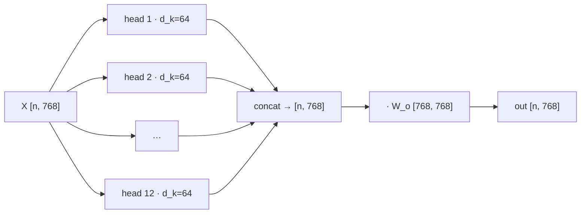

# Multi-Head Attention

Single-head [[attention-scaled-dot-product]] produces **one** distribution per token. That's a bottleneck: resolving a pronoun, tracking syntactic agreement, and holding onto the topic of the paragraph are different relationships, and one softmax row has to average them into a single compromise.

Multi-head attention runs `h` attentions in parallel over lower-dimensional slices:

$$\text{MHA}(X) = \text{Concat}(\text{head}_1, \dots, \text{head}_h)\,W_o, \qquad \text{head}_i = \text{Attention}(XW_q^i, XW_k^i, XW_v^i)$$

## The parameter count is the surprise

With `d_k = d_model / h`, multi-head attention costs **the same** as single-head. GPT-2 small: `d_model = 768`, `h = 12`, so `d_k = 64` per head. Twelve heads of width 64 concatenate back to 768.

You are not spending more compute. You are *partitioning* the same budget into subspaces that can specialize. That's the trade: each head sees a narrower slice of the representation, but gets its own independent attention pattern.

## W_o is doing real work

Concatenation alone would leave the heads' outputs living in disjoint blocks of the vector, never interacting. `W_o` mixes them, letting the layer form combinations across heads. Dropping it is a measurable loss, not a simplification.

## Interpretability, honestly

Some heads do turn out to have crisp jobs — previous-token heads, induction heads that complete `[A][B] ... [A] → [B]`, syntactic-dependency heads. This is real and reproducible.

But the framing is easy to overstate. Many heads are diffuse or redundant; a substantial fraction can be pruned after training with minimal loss. Heads are a useful *inductive bias*, not a set of hand-labeled modules.

## The variants you'll meet in real code

The `K`/`V` projections dominate inference memory (see [[kv-cache]]), so production models shrink them:

| Scheme | K/V heads | Notes |
|---|---|---|
| MHA | `h` | the original |
| **GQA** | `h / g` groups | Llama 2/3 default; big cache saving, small quality cost |
| **MQA** | 1 | one shared K/V for all query heads; cheapest, slight degradation |

Query heads stay at `h` in all three. Only the K/V side is reduced — because only K and V get cached.

:::check
If you double the number of heads while keeping `d_model` fixed, what happens to the parameter count and to `d_k`?
:::

:::check
What breaks if you concatenate head outputs and skip the `W_o` projection?
:::
