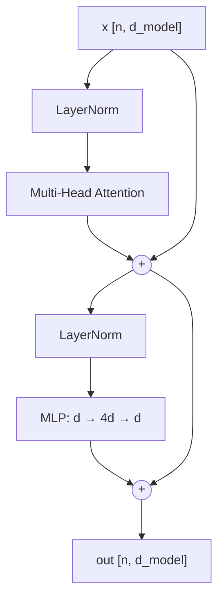

# The Transformer Block

Two sublayers, each wrapped in a pre-norm residual:

$$x \leftarrow x + \text{MHA}(\text{LN}(x))$$
$$x \leftarrow x + \text{MLP}(\text{LN}(x))$$



## The division of labour

This is the idea worth internalizing:

| Sublayer | Mixes across tokens? | Job |
|---|---|---|
| [[multi-head-attention]] | **yes** | move information between positions |
| MLP | **no** | transform each position independently |

The MLP is applied to every token separately with the *same* weights — a `1×1` convolution over the sequence. It has no idea its neighbors exist. So attention is the only route by which information travels between positions, and the MLP is the only place with the capacity to do nonlinear work on what arrived.

Alternate the two, `N` times, and each token's vector accumulates increasingly contextual, increasingly processed content in the residual stream.

## The MLP, and where the parameters actually are

```python
class MLP(nn.Module):
    def __init__(self, d, mult=4):
        super().__init__()
        self.up, self.down = nn.Linear(d, mult * d), nn.Linear(mult * d, d)
        self.act = nn.GELU()
    def forward(self, x):
        return self.down(self.act(self.up(x)))
```

The `4×` expansion is convention from the original paper, and it means the MLP holds `8 · d_model²` parameters against attention's `4 · d_model²`. **Roughly two thirds of a transformer's parameters are in the MLPs, not the attention.** People consistently guess the other way round.

Modern models use a gated variant (SwiGLU) with a `~2.7×` expansion across three matrices instead of two, landing at a similar total.

## The full block

```python
class Block(nn.Module):
    def __init__(self, d, n_heads):
        super().__init__()
        self.ln1, self.ln2 = nn.LayerNorm(d), nn.LayerNorm(d)
        self.attn, self.mlp = MultiHeadAttention(d, n_heads), MLP(d)
    def forward(self, x, mask=None):
        x = x + self.attn(self.ln1(x), mask=mask)   # pre-norm: residual path untouched
        x = x + self.mlp(self.ln2(x))
        return x
```

Pre-norm, for the reasons in [[layer-norm-residuals]]. Get this backwards and a deep stack won't converge.

## The whole model

```python
tok = Embedding(vocab, d)          # [[embeddings]]
x = tok(ids)                       # position enters via RoPE inside attention
for block in blocks: x = block(x, mask=causal)
logits = final_ln(x) @ tok.weight.T   # weight tying
```

That's it. GPT-2 small is this with `d_model=768, n_heads=12, N=12`. Llama 3 70B is this with `d_model=8192, N=80`, GQA, RMSNorm and SwiGLU. The block is unchanged since 2017 — what scaled was the numbers.

## Cost, per block

- attention: `O(n² · d)` — the `n × n` score matrix
- MLP: `O(n · d²)`

At short context the `d²` term dominates and the MLP is your bill. At long context `n²` takes over, which is what all the FlashAttention and sparse-attention work is attacking. The crossover is around `n ≈ d`.

:::check
Which sublayer moves information between token positions, and what does that imply about what the MLP can do alone?
:::

:::check
Which holds more parameters in a standard block — attention or the MLP? By roughly what ratio?
:::

:::check
At what sequence length does attention's cost start to dominate the MLP's?
:::
