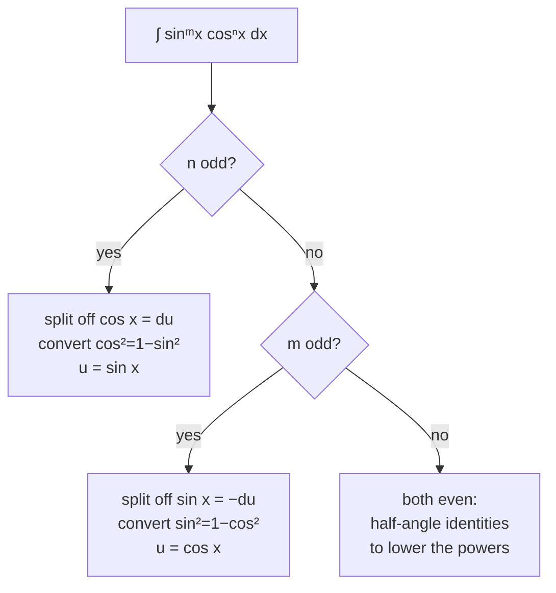

# Trigonometric Integrals

These look like a pile of special cases. They are actually one idea applied three ways: **manipulate the integrand until a $du$ falls out**, then run [[u-substitution]].

## The identities you must have cold

$$
\sin^2 x + \cos^2 x = 1 \qquad 1 + \tan^2 x = \sec^2 x
$$
$$
\sin^2 x = \frac{1 - \cos 2x}{2} \qquad \cos^2 x = \frac{1 + \cos 2x}{2}
$$

And the four derivatives that create $du$ opportunities:

$$
(\sin x)' = \cos x \quad (\cos x)' = -\sin x \quad (\tan x)' = \sec^2 x \quad (\sec x)' = \sec x\tan x
$$

Notice the pairing in the last two: $\sec^2$ and $\sec\tan$ are the two factor-groups that can serve as $du$ in the tangent–secant family.

## $\int \sin^m x\, \cos^n x\,dx$ — read the parities



```formula
title: Why an odd power is the easy case
tex: '\int \sin^m x\,\cos^{2k+1} x\,dx = \int u^m (1-u^2)^k\,du'
symbols: [integral, sin-fn, m-exp, x-var, cos-fn, k-exp, dx, equals, u-fn, minus, du]
reading: With an odd power of cosine, the whole integral becomes a polynomial in u, where u is sine of x.
steps:
  - An odd cosine power splits as 2k+1 — an even part and one factor left over.
  - That leftover cos x, together with dx, is exactly du for u = sin x. It leaves the integrand entirely.
  - The even part is k pairs of cos², and cos² = 1 − sin² converts every pair into u with no square roots.
  - Nothing but powers of u remains, so what was a trigonometric integral is now a polynomial.
notes:
  k-exp: Counts the *pairs* left behind. Pairs are what an identity can convert; a lone factor cannot be, which is why exactly one has to leave as du.
  m-exp: Never evaluated — it just rides along as an exponent. Only its parity would matter, and here it does not even do that.
  minus: This is the Pythagorean identity doing the work. It is the only reason the leftover cosines can become sines at all.
why: The parity is not a special case to memorise, it is **the whole method**. An odd power has a spare factor to donate to du; an even one has nothing to peel, so you must lower the powers with half-angle identities instead. That is why ∫sin³x is a two-line substitution and **∫sin²x is a different technique entirely**.
```

**Odd cosine power.** $\int \sin^4 x\cos^3 x\,dx$. Peel one cosine off, convert the rest:

$$
\int \sin^4 x \underbrace{\cos^2 x}_{1-\sin^2 x}\underbrace{\cos x\,dx}_{du},\quad u=\sin x \ \Rightarrow\ \int u^4(1-u^2)du = \frac{u^5}{5}-\frac{u^7}{7}+C
$$

**Both even.** $\int \sin^2 x\,dx$ has nothing to peel — every factor is paired. Lower the power instead:

$$
\int \sin^2 x\,dx = \int \frac{1-\cos 2x}{2}dx = \frac{x}{2} - \frac{\sin 2x}{4} + C
$$

Compare $\int\sin^3 x\,dx$, which is a two-line substitution. **One character of difference, two unrelated methods.** That is the thing to notice, and the reason to check parity *before* starting.

For $\int\sin^4 x\,dx$ you apply the half-angle identity, get a $\cos^2 2x$ term, and apply it again. Even powers cost you a pass per two degrees.

## $\int \tan^m x\,\sec^n x\,dx$ — same idea, different pairing

- **$n$ even** — peel off $\sec^2 x = du$, convert the remaining secants with $\sec^2 = 1+\tan^2$, take $u = \tan x$.
- **$m$ odd** — peel off $\sec x\tan x = du$, convert the remaining tangents with $\tan^2 = \sec^2 - 1$, take $u = \sec x$.
- **$m$ even and $n$ odd** — neither works. Convert everything to secants and use a reduction formula via [[integration-by-parts]]. This is the genuinely unpleasant case, and $\int \sec^3 x\,dx$ is its canonical example.

Two results worth memorizing rather than rederiving:

$$
\int \tan x\,dx = \ln|\sec x| + C \qquad \int \sec x\,dx = \ln|\sec x + \tan x| + C
$$

The second is proved by the multiply-by-a-clever-1 trick; nobody discovers it under exam pressure.

## Products of different frequencies

$$
\int \sin(mx)\cos(nx)\,dx
$$

No substitution helps. Use the product-to-sum identities to turn the product into a sum of single sines, then integrate term by term. When $m \ne n$ these integrate to zero over a full period — that orthogonality is the entire foundation of Fourier series, which is where this apparently pointless case is going.

## Why this matters beyond the exercises

[[trigonometric-substitution]] converts algebraic integrands into trigonometric ones. Everything on this page is what you do *after* that conversion. Weak trig integrals means trig substitution will stall halfway through, and it will look like the substitution failed when the real gap is here.

:::check
For $\int \sin^m x \cos^n x\,dx$, what decides your strategy, and what are the three cases?
:::

:::check
Why does an odd power make the problem easy, in terms of what substitution needs?
:::

:::check
Both $\int\sin^2 x\,dx$ and $\int\sin^3 x\,dx$ look similar. Why are they solved by completely different methods?
:::
