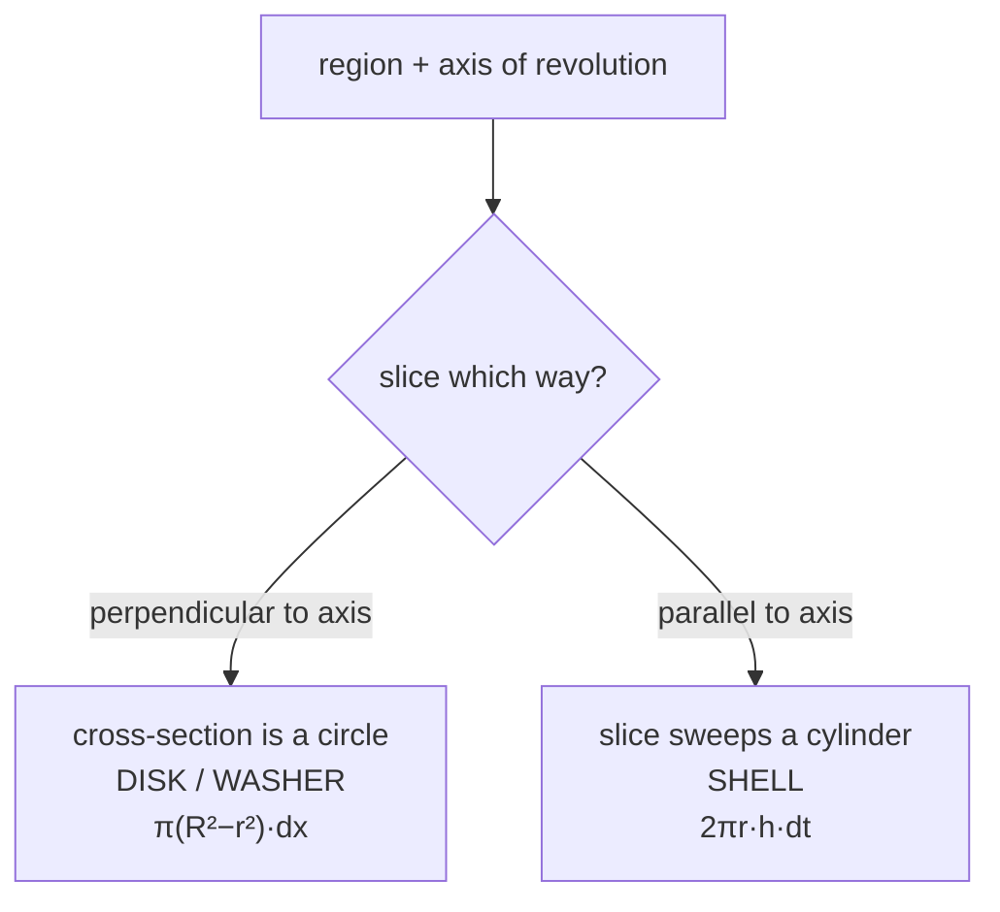

# Volumes of Revolution

Take a plane region, spin it about a line, and ask for the volume of the solid swept out. The method is exactly the one from [[area-between-curves]]: **identify one slice, write its volume, integrate**. The only new question is which direction to slice.

## The two directions



That is the entire taxonomy. Perpendicular slices are circles; parallel slices are cylinders.

```viz
type: solid
```

## Disks and washers

Slice perpendicular to the axis. Each slice is a thin circular plate of thickness $dx$:

$$
dV = \pi R(x)^2\,dx \qquad\Longrightarrow\qquad V = \pi\int_a^b R(x)^2\,dx
$$

If the solid has a hole — the region doesn't touch the axis — the slice is an annulus, and you subtract **areas**:

$$
dV = \pi\big[R_{\text{out}}(x)^2 - R_{\text{in}}(x)^2\big]dx
$$

**Not** $\pi(R_{\text{out}}-R_{\text{in}})^2$. That expression squares a difference instead of differencing squares, and it corresponds to no region at all. It is the single most common error in this topic.

The radius is a **distance to the axis**, which is why revolving about $y=2$ instead of $y=0$ changes $R$ from $f(x)$ to $|f(x)-2|$. Get the axis into the radius explicitly rather than reusing a memorized formula.

## Shells

Slice parallel to the axis. A vertical strip at distance $r$ from the axis, of height $h$ and thickness $dt$, sweeps out a thin cylindrical shell. Unroll it: a sheet of length $2\pi r$ (the circumference), height $h$, thickness $dt$:

$$
dV = 2\pi\,r\,h\,dt \qquad\Longrightarrow\qquad V = 2\pi\int r(t)\,h(t)\,dt
$$

The unrolling picture is worth holding onto — it makes $2\pi r h$ obviously right instead of one more thing to memorize.

## Choosing the method

Both methods always work. One is usually far less painful.

| Situation | Prefer |
|---|---|
| Region given as $y=f(x)$, revolved about a **horizontal** axis | washers (slice ⊥, in $x$) |
| Region given as $y=f(x)$, revolved about a **vertical** axis | **shells** (no need to solve for $x$) |
| Solving for the other variable needs $\pm$ branches | the method that avoids it |
| Region has a hole | washers handle it directly |

**The decisive question: would this method force me to invert a function?** Revolving $y=x^2$ and $y=x$ about the $y$-axis with washers needs $x=\sqrt y$ and $x=y$; with shells you stay in $x$ throughout. That's the reason shells exist.

## Slicing without revolving

The same idea handles solids that aren't revolutions at all. If a solid has known cross-sectional area $A(x)$ perpendicular to an axis — squares, equilateral triangles, semicircles on a base region:

$$
V = \int_a^b A(x)\,dx
$$

Disks are just the case $A = \pi R^2$. Recognizing that these are one method rather than four is what makes this stage manageable.

:::check
What is the geometric difference between the disk/washer method and the shell method?
:::

:::check
Give the slice volume for a washer and for a shell.
:::

:::check
Why is $(R_{\text{out}} - R_{\text{in}})^2$ wrong for a washer?
:::

:::check
A region between $y=x^2$ and $y=x$ is revolved about the $y$-axis. Which method avoids solving for $x$, and why?
:::
