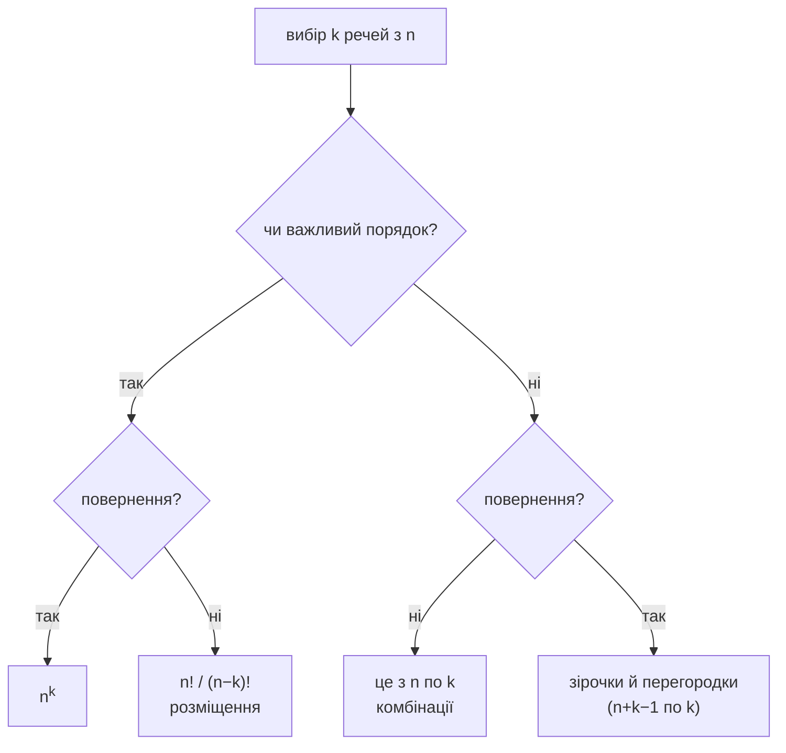

# Лічба та комбінаторика

Щойно простір має рівноймовірні результати, ймовірність — це арифметика, але арифметика тут — лічба, і складність переїжджає саме туди. Два питання розв’язують майже кожен випадок.

## Два питання



Три з чотирьох варто знати напам’ять. Четверте, зірочки й перегородки, варто впізнавати, щоб знати, що формула існує.

**Чи важливий порядок**, вирішує питання, а не об’єкти. Роздати п’ять карт одному гравцеві — порядок неважливий. Роздати їх п’ятьом різним гравцям — важливий.

## Чому біноміальний коефіцієнт ділить

```formula
title: Це з n по k
tex: '\binom{n}{k} = \frac{n!}{k!\,(n-k)!}'
symbols: [binom-coef, equals, frac-bar, n-trials, factorial, k-count, minus]
reading: >-
  Кількість способів вибрати k речей з n, коли порядок неважливий, — n факторіал,
  поділений на k факторіал помножене на n мінус k факторіал.
steps:
  - >-
    Спершу вишикуйте k місць по порядку. Для першого n варіантів, для другого n−1 і
    так далі.
  - >-
    Цей добуток — n!/(n−k)!, кількість упорядкованих виборів.
  - >-
    Але впорядкованих ви не хотіли. Кожен невпорядкований вибір пораховано по разу
    на кожен спосіб розташувати його k елементів.
  - >-
    Таких розташувань k!, тож ділення на k! згортає кожну групу до того одного
    вибору, яким вона насправді була.
notes:
  factorial: >-
    Тут дві різні роботи. Чисельник рахує впорядкування всього; знаменники
    виділяють упорядкування, яких ви не хотіли розрізняти.
  k-count: >-
    Скільки ви берете. Зверніть увагу на симетрію — вибрати k, щоб лишити, те саме,
    що вибрати n−k, щоб відкинути, тому формула не змінюється від їхньої
    перестановки.
  minus: >-
    Що лишилося після вибору. Два факторіали внизу — дві групи, на які ви
    розбиваєте n.
why: >-
  Ділення — уся ідея, і це той самий хід, що **свідомо перерахувати, а потім
  виправити**. Ця схема проходить крізь усю комбінаторику — порахуйте щось легке,
  що рахує кожну ціль кілька разів, і поділіть на кратність. Саме тому це
  *кількість*, а не ймовірність, і біноміальному розподілу вона потрібна окремим
  множником.
```

## Розв’язання з видимими міркуваннями

**П’ятикартна рука рівно з двома тузами.** Виберіть, які 2 з 4 тузів: $\binom{4}{2} = 6$. Інші 3 карти виберіть із 48 нетузів: $\binom{48}{3} = 17296$. Перемножте, бо вибори незалежні:

$$
P = \frac{\binom{4}{2}\binom{48}{3}}{\binom{52}{5}} = \frac{6 \cdot 17296}{2598960} \approx 0.0399
$$

Структура — **вибери з кожної групи, перемнож, поділи на загальну кількість** — шаблон для кожної гіпергеометричної задачі.

**Задача про дні народження.** Яка ймовірність, що серед 23 людей у двох збігається день народження? Прямий підрахунок означає об’єднання $\binom{23}{2} = 253$ перекривних подій для пар, а включення–виключення на 253 множинах не станеться. Доповнення — один добуток:

$$
P(\text{усі різні}) = \frac{365}{365}\cdot\frac{364}{365}\cdots\frac{343}{365} \approx 0.4927
$$

тож відповідь — приблизно $0.507$. **Доповнення — це метод, а не фокус**, див. [[probability-axioms]]. Щойно подія — «хоча б один», спершу спробуйте «жодного».

## Способи помилитися

**Рахувати впорядковане, коли задача невпорядкована, чи навпаки.** Симптом — відповідь, що відрізняється рівно на $k!$. Якщо ймовірність вийшла більшою за 1, майже завжди причина тут.

**Змішувати домовленості в одній задачі.** Якщо чисельник рахує впорядковані результати, знаменник теж мусить. Обидві домовленості дають правильну відповідь; суміш — ніколи.

**Вважати рівноймовірним, бо об’єкти схожі.** Витягування без повернення змінює ймовірності по ходу. Формула лічби все одно застосовна до *результатів*, але лише якщо ви рахували результати, а не етапи.

**Перемножувати кількості, що не є незалежними виборами.** «Виберіть капітана, потім ще 4 гравців з решти 10» — гаразд. «Виберіть 5 гравців, потім капітана» рахує ту саму команду п’ять разів, якщо не пильнувати, що саме ви перелічуєте.

## Де це з’явиться далі

Біноміальний коефіцієнт одразу з’являється в [[bernoulli-and-binomial]], де робить рівно описану вище роботу — перетворює ймовірність *однієї конкретної* послідовності успіхів на ймовірність *будь-якої* послідовності з такою їх кількістю. Це різниця між формулою з двох множників і формулою з трьох.

:::check
Які два питання визначають, яка формула лічби застосовна?
:::

:::check
Чому біноміальний коефіцієнт ділить на $k!$?
:::

:::check
Чому в задачі про дні народження обчислюють ймовірність, що всі дні різні, а не ймовірність, що якась пара збігається?
:::
