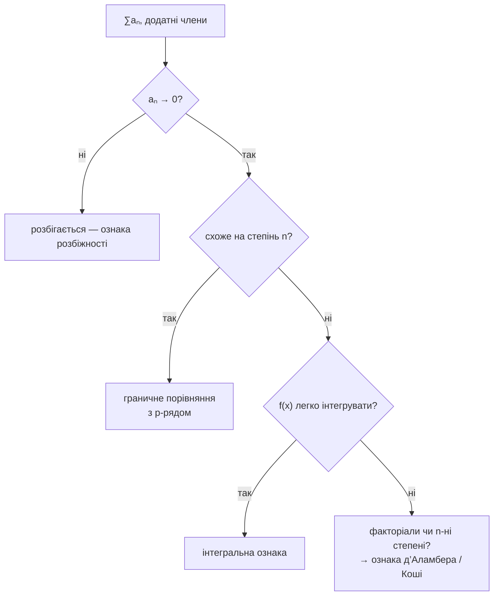

# Інтегральна ознака та ознаки порівняння

Точні суми майже для кожного ряду безнадійні, тож питання стає таким: чи збігається? Обидві ознаки тут відповідають однаково — **порівняйте з тим, що вже зрозуміле.**

Усі ці ознаки вимагають **додатних членів** (або зрештою додатних). Додатні члени роблять $S_N$ зростаючою, тож за теоремою про монотонну збіжність лишаються лише два варіанти: «обмежена, отже, збігається» і «необмежена, отже, розбігається». Саме ця дихотомія і змушує порівняння працювати. Рядам зі змішаними знаками потрібна [[alternating-series-and-absolute-convergence]].

## Інтегральна ознака

Якщо $f$ додатна, неперервна й зрештою спадна на $[1,\infty)$, і $a_n = f(n)$:

$$
\sum_{n=1}^{\infty}a_n \ \text{збігається} \iff \int_1^{\infty}f(x)\,dx\ \text{збігається}
$$

Рисунок і є доведенням. Намалюйте прямокутники ширини 1 і висоти $a_n$ поруч із кривою $y=f(x)$. Розміщені праворуч від кожної точки вибору, вони лежать під кривою; ліворуч — над нею. Тож ряд затиснутий між $\int f$ і $\int f + a_1$ — скінченні чи нескінченні разом.

**Важливі всі три гіпотези.** Саме спадання змушує прямокутники щільно прилягати до кривої; без нього рисунок не працює.

І зверніть увагу, чого ознака *не* стверджує: ряд і інтеграл **не рівні**. $\sum 1/n^2 = \pi^2/6 \approx 1.645$, тоді як $\int_1^\infty x^{-2}dx = 1$. Ознака переносить збіжність, а не значення.

## p-ряди — мірило

Застосуйте інтегральну ознаку до $f(x) = x^{-p}$ і зчитайте результат про p-інтеграли з [[improper-integrals]]:

$$
\boxed{\sum_{n=1}^{\infty}\frac{1}{n^p}\ \text{збігається} \iff p > 1}
$$

$$
\sum\frac{1}{n^2}\ \checkmark \qquad \sum\frac{1}{n^{1.001}}\ \checkmark \qquad \sum\frac{1}{n}\ \times \qquad \sum\frac{1}{\sqrt n}\ \times
$$

$p=1$ розбігається. Усе вище за 1, хай навіть трохи, збігається. **Це найкорисніший окремий факт етапу** — більшість рядів, що трапляються, поводяться як якийсь степінь $n$, а порівняння перетворює цю схожість на вердикт.

```viz
type: series
```

Порівняйте **∑1/n** з **∑1/√n** і **∑1/n²** за великого N. У всіх трьох члени прямують до нуля; усталюється лише останній.

## Пряме порівняння

Для $0 \le a_n \le b_n$:

- $\sum b_n$ збігається $\Longrightarrow$ $\sum a_n$ збігається — *менше за скінченне скінченне*
- $\sum a_n$ розбігається $\Longrightarrow$ $\sum b_n$ розбігається — *більше за нескінченне нескінченне*

**Напрямок — усе.** Оцінка вашого ряду *знизу* збіжним нічого не дає; оцінка *зверху* розбіжним нічого не дає. Обидва — поширені хибні повороти, і обидва здаються поступом, поки ви їх робите.

$$
\sum\frac{1}{n^2+1}: \quad \frac{1}{n^2+1}<\frac{1}{n^2},\ \text{збіжний p-ряд} \ \Rightarrow\ \text{збігається}
$$

## Гранична ознака порівняння — зазвичай кращий інструмент

Якщо $a_n, b_n > 0$ і

```formula
title: Гранична ознака порівняння
tex: '\lim_{n\to\infty}\frac{a_n}{b_n} = L, \qquad 0 < L < \infty'
symbols: [limit, n-index, infinity, frac-bar, a-term, b-term, equals, L-limit, less-than]
reading: >-
  Якщо відношення ваших членів до відомої послідовності прямує до скінченного
  ненульового числа, два ряди поводяться однаково.
steps:
  - >-
    Оберіть для порівняння bₙ, про ряд якого ви вже знаєте, збігається він чи
    розбігається.
  - >-
    Складіть відношення вашого члена до нього й знайдіть границю.
  - >-
    Якщо ця границя — скінченне число й не нуль, дві послідовності спадають з
    однаковою швидкістю.
  - >-
    Тоді два ряди мають спільний вердикт — ваш збігається рівно тоді, коли
    збігається ряд для порівняння.
notes:
  b-term: >-
    Мірило, а не те, що вимірюють. Обирайте його, лишаючи тільки старший степінь
    угорі й унизу, — саме це змушує відношення усталитися.
  less-than: >-
    Важливі обидві строгості. L = 0 чи L = ∞ означає, що два спадають з
    по-справжньому різною швидкістю, і ознака нічого не каже.
  L-limit: >-
    Не відповідь, а лише вердикт. Його справжнє значення неважливе, щойно відомо,
    що воно скінченне й ненульове.
why: >-
  Пряме порівняння вимагає правдивої нерівності для кожного члена, яку морочливо
  влаштувати і яка часто просто хибна в потрібний бік. Граничному порівнянню
  потрібно лише, щоб збігалися **швидкості**, тож воно працює на заплутаних
  алгебраїчних дробах, на яких пряме давиться. p-ряди — мірило для всього:
  **∑1/n^p збігається рівно тоді, коли p > 1**.
```

то обидва ряди поводяться однаково.

Цим значно легше користуватися, бо не треба *доводити* нерівність — досить помітити, що дві речі ростуть з однаковою швидкістю.

$$
\sum\frac{2n^2+3n}{n^4 - n + 1}
$$

Лишіть старші степені: $\frac{2n^2}{n^4} = \frac{2}{n^2}$. Порівняйте з $b_n = 1/n^2$; відношення прямує до 2, скінченного й додатного; $p$-ряд збігається; отже, збігається й вихідний. Побудова нерівності для прямого порівняння тут забрала б справжні зусилля й нічого б не дала.

**Як обрати $b_n$:** відкиньте все, крім найвищого степеня в чисельнику й знаменнику. Це правило, і воно працює, бо члени нижчого порядку в границі неважливі.

Два межові випадки: якщо $L=0$, то збіжність $\sum b_n$ однаково дає збіжність $\sum a_n$ (а розбіжність нічого не дає); якщо $L=\infty$, імплікації обертаються. Тримайтеся $0<L<\infty$ — і вони не знадобляться.

## Вибір ознаки



Спершу — ознака розбіжності, вона дешева. Далі для всього, що виглядає алгебраїчним від $n$, типовий вибір — граничне порівняння з p-рядом. Інтегральну ознаку лишайте для випадків, коли первісна справді доступна, як-от членів з $\ln n$.

:::check
Сформулюйте інтегральну ознаку з її гіпотезами і скажіть, чого вона не повідомляє.
:::

:::check
За яких $p$ збігається $\sum 1/n^p$ і чому це найкорисніший факт цього етапу?
:::

:::check
Пряме порівняння вимагає нерівності в правильний бік. Які два коректні висновки?
:::

:::check
Чому граничну ознаку порівняння зазвичай легше застосовувати, ніж пряму?
:::
