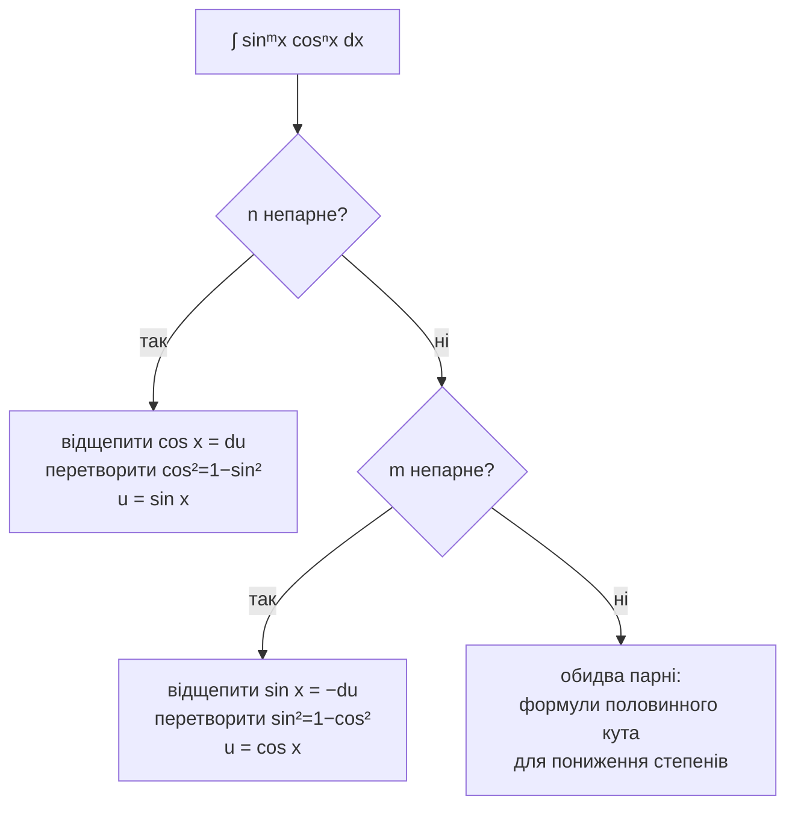

# Тригонометричні інтеграли

Вони виглядають як купа окремих випадків. Насправді це одна ідея, застосована трьома способами: **перетворюйте підінтегральний вираз, доки з нього не випаде $du$**, а тоді застосовуйте [[u-substitution]].

## Тотожності, які треба знати напам’ять

$$
\sin^2 x + \cos^2 x = 1 \qquad 1 + \tan^2 x = \sec^2 x
$$
$$
\sin^2 x = \frac{1 - \cos 2x}{2} \qquad \cos^2 x = \frac{1 + \cos 2x}{2}
$$

І чотири похідні, що створюють можливості для $du$:

$$
(\sin x)' = \cos x \quad (\cos x)' = -\sin x \quad (\tan x)' = \sec^2 x \quad (\sec x)' = \sec x\tan x
$$

Зверніть увагу на пари в двох останніх: $\sec^2$ і $\sec\tan$ — дві групи множників, що можуть правити за $du$ у родині тангенса–секанса.

## $\int \sin^m x\, \cos^n x\,dx$ — дивіться на парність



```formula
title: Чому непарний степінь — легкий випадок
tex: '\int \sin^m x\,\cos^{2k+1} x\,dx = \int u^m (1-u^2)^k\,du'
symbols: [integral, sin-fn, m-exp, x-var, cos-fn, k-exp, dx, equals, u-fn, minus, du]
reading: >-
  За непарного степеня косинуса весь інтеграл стає многочленом від u, де u —
  синус x.
steps:
  - >-
    Непарний степінь косинуса розкладається як 2k+1 — парна частина й один
    зайвий множник.
  - >-
    Цей зайвий cos x разом із dx — рівно du для u = sin x. Він повністю залишає
    підінтегральний вираз.
  - >-
    Парна частина — k пар cos², і cos² = 1 − sin² перетворює кожну пару на u без
    жодних коренів.
  - >-
    Лишаються тільки степені u, тож тригонометричний інтеграл став многочленом.
notes:
  k-exp: >-
    Рахує *пари*, що лишилися. Пари тотожність перетворити може; одиночний
    множник — ні, тому рівно один мусить піти як du.
  m-exp: >-
    Ніколи не обчислюється — просто їде далі як показник. Важила б лише його
    парність, а тут навіть вона не важить.
  minus: >-
    Тут працює основна тригонометрична тотожність. Лише завдяки їй зайві косинуси
    взагалі можуть стати синусами.
why: >-
  Парність — не окремий випадок для запам’ятовування, а **увесь метод**.
  Непарний степінь має зайвий множник, який можна віддати на du; парний не має
  чого відщепити, тож степені доводиться понижувати формулами половинного кута.
  Тому ∫sin³x — заміна на два рядки, а **∫sin²x — зовсім інший метод**.
```

**Непарний степінь косинуса.** $\int \sin^4 x\cos^3 x\,dx$. Відщепіть один косинус, решту перетворіть:

$$
\int \sin^4 x \underbrace{\cos^2 x}_{1-\sin^2 x}\underbrace{\cos x\,dx}_{du},\quad u=\sin x \ \Rightarrow\ \int u^4(1-u^2)du = \frac{u^5}{5}-\frac{u^7}{7}+C
$$

**Обидва парні.** У $\int \sin^2 x\,dx$ відщепити нічого — кожен множник у парі. Натомість понизьте степінь:

$$
\int \sin^2 x\,dx = \int \frac{1-\cos 2x}{2}dx = \frac{x}{2} - \frac{\sin 2x}{4} + C
$$

Порівняйте з $\int\sin^3 x\,dx$ — заміною на два рядки. **Різниця в один символ, два непов’язані методи.** Саме це треба помітити, і саме тому парність перевіряють *до* початку.

Для $\int\sin^4 x\,dx$ застосовуєте формулу половинного кута, отримуєте доданок $\cos^2 2x$ і застосовуєте її знову. Парні степені коштують по проходу на кожні два степені.

## $\int \tan^m x\,\sec^n x\,dx$ — та сама ідея, інші пари

- **$n$ парне** — відщепіть $\sec^2 x = du$, решту секансів перетворіть через $\sec^2 = 1+\tan^2$, візьміть $u = \tan x$.
- **$m$ непарне** — відщепіть $\sec x\tan x = du$, решту тангенсів перетворіть через $\tan^2 = \sec^2 - 1$, візьміть $u = \sec x$.
- **$m$ парне і $n$ непарне** — не працює ні те, ні те. Перетворіть усе на секанси й скористайтеся формулою пониження через [[integration-by-parts]]. Це справді неприємний випадок, і $\int \sec^3 x\,dx$ — його канонічний приклад.

Два результати варто запам’ятати, а не виводити щоразу:

$$
\int \tan x\,dx = \ln|\sec x| + C \qquad \int \sec x\,dx = \ln|\sec x + \tan x| + C
$$

Другий доводять фокусом «помножити на хитру одиницю»; під тиском іспиту його ніхто не відкриває.

## Добутки різних частот

$$
\int \sin(mx)\cos(nx)\,dx
$$

Жодна заміна не допоможе. Скористайтеся формулами перетворення добутку на суму, щоб перетворити добуток на суму окремих синусів, і інтегруйте почленно. При $m \ne n$ за повний період вони інтегруються в нуль — ця ортогональність є всім фундаментом рядів Фур’є, куди й веде цей на перший погляд безглуздий випадок.

## Чому це важливо поза вправами

[[trigonometric-substitution]] перетворює алгебраїчні підінтегральні вирази на тригонометричні. Усе на цій сторінці — те, що робиться *після* цього перетворення. Слабкі тригонометричні інтеграли означають, що тригонометрична підстановка застрягне на пів дорозі, і здаватиметься, що не вдалася підстановка, хоча справжня прогалина тут.

:::check
Що визначає стратегію для $\int \sin^m x \cos^n x\,dx$ і які три випадки?
:::

:::check
Чому непарний степінь робить задачу легкою — з огляду на те, що потрібно для заміни?
:::

:::check
$\int\sin^2 x\,dx$ і $\int\sin^3 x\,dx$ схожі на вигляд. Чому їх розв’язують зовсім різними методами?
:::
