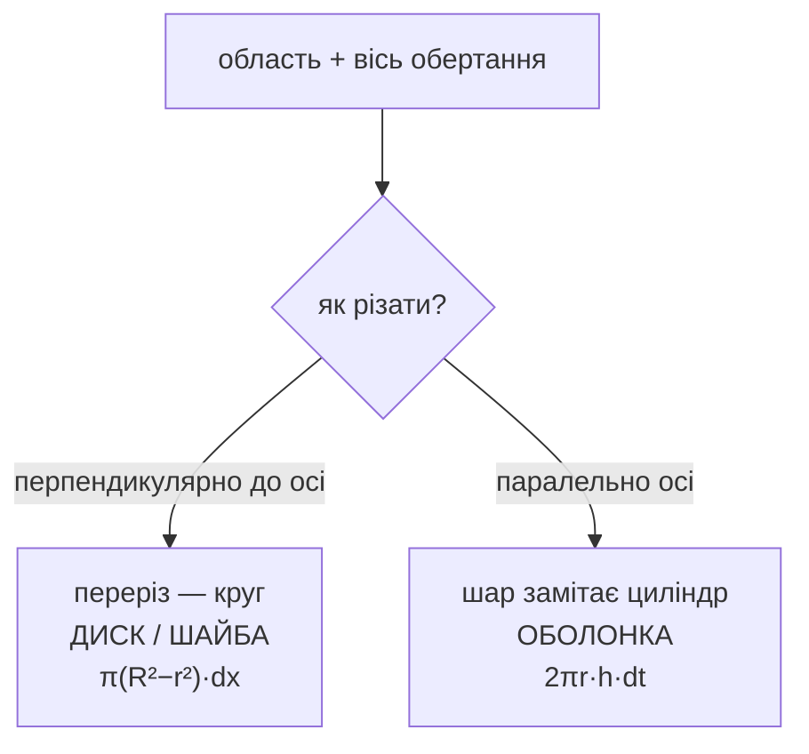

# Об’єми тіл обертання

Візьміть плоску область, оберніть її навколо прямої й спитайте про об’єм отриманого тіла. Метод — рівно той, що в [[area-between-curves]]: **визначте один шар, запишіть його об’єм, проінтегруйте**. Єдине нове питання — у якому напрямку різати.

## Два напрямки



Це вся класифікація. Перпендикулярні шари — круги; паралельні — циліндри.

```viz
type: solid
```

## Диски й шайби

Ріжте перпендикулярно до осі. Кожен шар — тонка кругла пластина товщини $dx$:

$$
dV = \pi R(x)^2\,dx \qquad\Longrightarrow\qquad V = \pi\int_a^b R(x)^2\,dx
$$

Якщо в тілі є отвір — область не торкається осі, — шар є кільцем, і віднімати треба **площі**:

```formula
title: Шайба
tex: 'V = \pi\int_a^b \big[R(x)^2 - r(x)^2\big]\,dx'
symbols: [V-vol, equals, pi-const, integral, bound-a, bound-b, R-outer, x-var, minus, r-inner, dx]
reading: >-
  Об’єм — це пі на інтеграл від квадрата зовнішнього радіуса мінус квадрат
  внутрішнього.
steps:
  - >-
    Ріжте перпендикулярно до осі. Тоді кожен переріз — круг або круг з отвором.
  - >-
    Пластина має площу πR², з середини якої вирізано диск площі πr².
  - >-
    Помножте цю площу на товщину dx — отримаєте об’єм одного шару.
  - >-
    Інтегруйте, щоб додати шари вздовж осі.
notes:
  minus: >-
    Віднімають *площі*, тож квадрати йдуть до віднімання. π(R−r)² натомість
    підносить до квадрата різницю, не описує жодної області й є стандартною
    помилкою в цій темі.
  R-outer: >-
    Відстань до осі. Обертання навколо y = 2 замість y = 0 робить її |f(x) − 2| —
    явно вводьте вісь у радіус, а не використовуйте завчену формулу.
  r-inner: >-
    Нуль, коли область торкається осі. Це єдина різниця між шайбою й диском.
why: >-
  Перпендикулярні шари — круги; паралельні — циліндри. Це **вся класифікація**, і
  обидва методи завжди працюють — просто один значно менш болісний. Вирішальне
  питання завжди одне: **чи змусить мене цей метод обертати функцію?** Саме тому
  існують оболонки.
```

**Не** $\pi(R-r)^2$. Цей вираз підносить до квадрата різницю замість різниці квадратів і не відповідає жодній області. Це найпоширеніша помилка в темі.

Радіус — це **відстань до осі**, тому обертання навколо $y=2$ замість $y=0$ змінює $R$ з $f(x)$ на $|f(x)-2|$. Явно вводьте вісь у радіус, а не використовуйте завчену формулу.

## Оболонки

Ріжте паралельно осі. Вертикальна смужка на відстані $r$ від осі, висоти $h$ і товщини $dt$, замітає тонку циліндричну оболонку. Розгорніть її: аркуш довжини $2\pi r$ (довжина кола), висоти $h$, товщини $dt$:

$$
dV = 2\pi\,r\,h\,dt \qquad\Longrightarrow\qquad V = 2\pi\int r(t)\,h(t)\,dt
$$

Картинку з розгортанням варто тримати в голові — вона робить $2\pi r h$ очевидно правильним, а не ще одним рядком для завчання.

## Вибір методу

Обидва методи завжди працюють. Один зазвичай значно менш болісний.

| Ситуація | Кращий вибір |
|---|---|
| Область задано як $y=f(x)$, обертання навколо **горизонтальної** осі | шайби (шар ⊥, за $x$) |
| Область задано як $y=f(x)$, обертання навколо **вертикальної** осі | **оболонки** (не треба розв’язувати відносно $x$) |
| Розв’язання відносно іншої змінної дає гілки $\pm$ | метод, що цього уникає |
| В області є отвір | шайби справляються напряму |

**Вирішальне питання: чи змусить мене цей метод обертати функцію?** Обертання $y=x^2$ і $y=x$ навколо осі $y$ шайбами вимагає $x=\sqrt y$ і $x=y$; з оболонками ви весь час лишаєтеся в $x$. Ось навіщо існують оболонки.

## Нарізання без обертання

Та сама ідея працює для тіл, які взагалі не є тілами обертання. Якщо тіло має відому площу перерізу $A(x)$, перпендикулярного до осі, — квадрати, рівносторонні трикутники, півкруги на базовій області:

$$
V = \int_a^b A(x)\,dx
$$

Диски — лише випадок $A = \pi R^2$. Розуміння того, що це один метод, а не чотири, і робить цей етап підйомним.

:::check
Яка геометрична різниця між методом дисків/шайб і методом оболонок?
:::

:::check
Запишіть об’єм шару для шайби й для оболонки.
:::

:::check
Чому $(R_{\text{out}} - R_{\text{in}})^2$ для шайби хибне?
:::

:::check
Область між $y=x^2$ і $y=x$ обертають навколо осі $y$. Який метод дозволяє не розв’язувати відносно $x$ і чому?
:::
